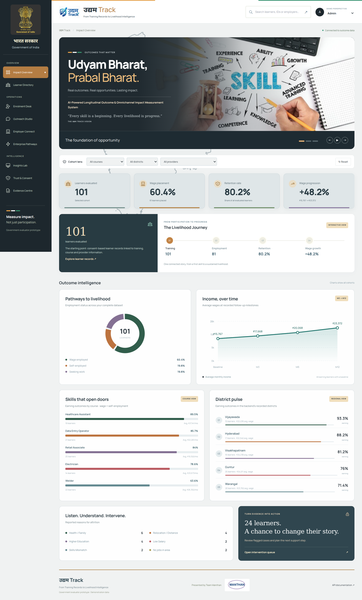
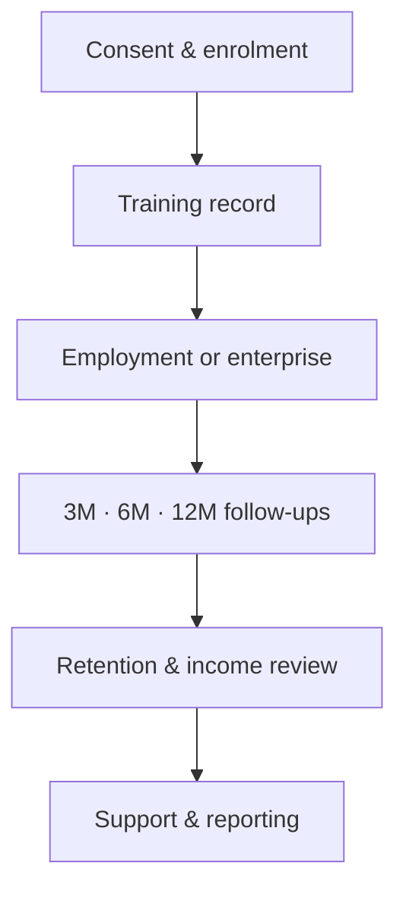
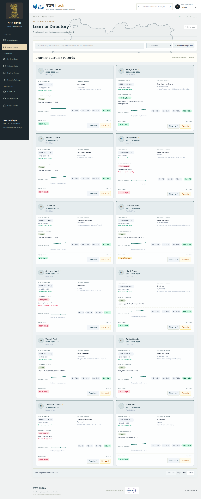
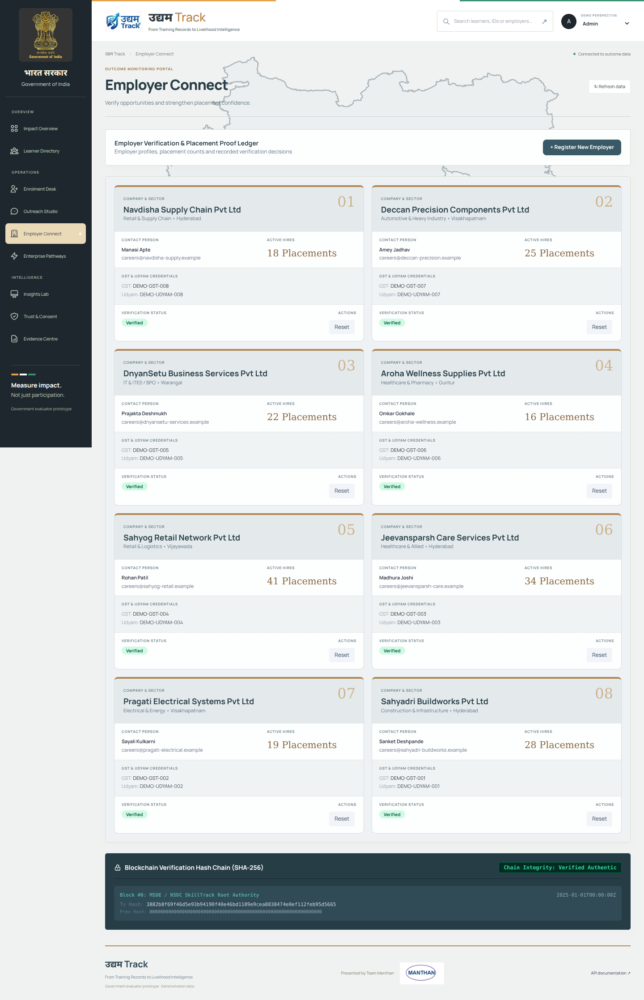
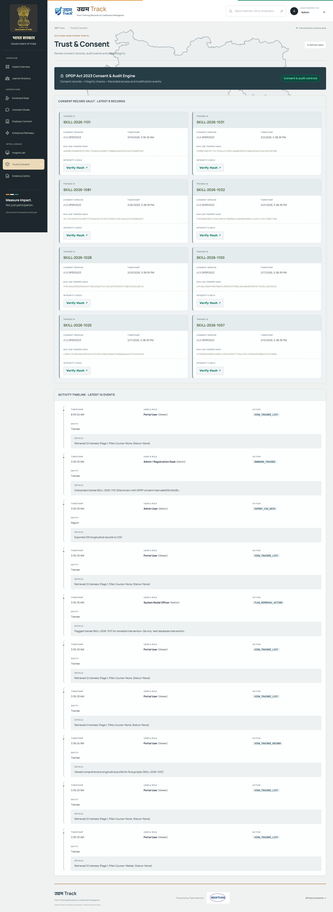
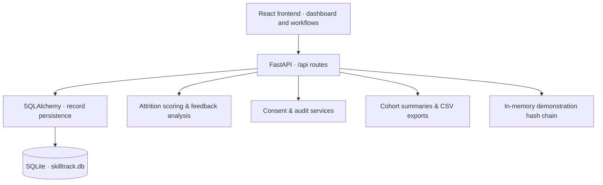

<div align="center">

# उद्यम Track

### From Training Records to Livelihood Intelligence

**AI-Powered Longitudinal Outcome & Omnichannel Impact Measurement System**

Training → Employment → Retention → Wage Progression

**Presented by Team Manthan EK SOACH**

[Overview](#overview) · [Platform](#platform-capabilities) · [Architecture](#system-architecture) · [Setup](#local-setup) · [Documentation](#api-documentation)

</div>

---

## Overview

**उद्यम Track** is a skilling-outcomes prototype that connects learner records with employment, self-employment, follow-up responses and income progression. It helps evaluators explore what happens after training and identify learners who may need further support.

The platform brings these records into a single workspace for cohort analysis, employer review, consent tracking and evidence-based reporting.

> **Measure impact, not just participation.**



*Dashboard preview from a local demonstration dataset. Displayed figures are illustrative records, not measured programme impact or official statistics.*

## The outcome-tracking workflow

Training completion is one milestone in a longer livelihood journey. The platform follows recorded outcomes across baseline, 3-month, 6-month and 12-month observations.



## Platform capabilities

| Workspace | Purpose | Available functions |
|---|---|---|
| **Impact Overview** | Understand cohort outcomes | Placement and retention indicators, wage trends, course comparisons, district summaries and intervention counts |
| **Learner Directory** | Review individual progress | Searchable learner cards, status filters, wage milestones, detailed timelines and remedial flags |
| **Enrolment Desk** | Create learner records | Guided registration, consent capture and a simulated OTP flow |
| **Outreach Studio** | Demonstrate follow-up conversations | WhatsApp/SMS-style simulation, response capture and conversation history |
| **Employer Connect** | Review employer evidence | Company profiles, registration, verification status and a demonstration hash-chain ledger |
| **Enterprise Pathways** | Recognise self-employment | Business profiles, monthly revenue and recorded proof metadata |
| **Insights Lab** | Explore risk signals | Attrition scoring, contributing factors and feedback analysis |
| **Trust & Consent** | Inspect consent and recorded activity | Consent cards, audit timelines and consent-hash checks |
| **Evidence Centre** | Prepare outcome summaries | Cohort report, CSV export and print-to-PDF support |

## Interface gallery

The interface uses a charcoal and bronze theme, slate metric cards, a larger image carousel and a Maharashtra outline watermark. Responsive layouts support desktop and mobile access.

<details>
<summary><strong>Learner Directory — individual outcome records</strong></summary>



</details>

<details>
<summary><strong>Employer Connect — company profiles and verification</strong></summary>



</details>

<details>
<summary><strong>Trust & Consent — consent records and integrity checks</strong></summary>



</details>

## System architecture

The browser communicates with the FastAPI application through the existing `/api` routes. SQLAlchemy manages persistent records in SQLite. The same application serves the compiled frontend.



### Technology stack

| Layer | Implementation |
|---|---|
| User interface | React, JavaScript/JSX, CSS and Tailwind utilities |
| Frontend build | esbuild and Tailwind CSS |
| API | Python, FastAPI and Uvicorn |
| Persistence | SQLAlchemy and SQLite |
| Data validation | Pydantic |
| Analytical features | Python logistic scoring with fixed coefficients and keyword-based feedback analysis |
| Record safeguards | PII encryption/masking, consent hashes and recorded audit events |
| Reporting | API-generated summaries, CSV exports and browser printing |

## Reading the dashboard

| Indicator | Interpretation |
|---|---|
| Learners evaluated | Number of learner records in the selected cohort |
| Wage placement | Share of the selected cohort recorded as wage-employed |
| Retention | Share of all evaluated records marked as retained by the current backend |
| Wage progression | Change between recorded baseline and current average wages for eligible earning learners |
| Course and district earning rates | Combined wage-employment and self-employment outcomes |

**Filter scope:** course, provider and district filters affect the dashboard KPI cards and Livelihood Journey. The aggregation charts, reports and CSV export use the full dataset. The interface identifies charts as showing all cohorts.

## Local setup

### Prerequisites

- Python with `pip` and the dependencies listed in `requirements.txt`.
- Git to clone the repository.
- Node.js and npm only when rebuilding the frontend source.

### 1. Clone the project

```powershell
git clone https://github.com/saumya0723/UdyamTrack.git
cd UdyamTrack
```

Run the following commands from the folder containing `backend`, `frontend`, `requirements.txt` and `server_run.py`.

### 2. Create an environment and install dependencies

```powershell
python -m venv .venv
.\.venv\Scripts\python.exe -m pip install -r requirements.txt
```

### 3. Start the application

```powershell
.\.venv\Scripts\python.exe server_run.py
```

Open **http://127.0.0.1:8000** in your browser. The backend serves the frontend directly; a separate frontend server is not required.

Keep `demo_names.json` beside `server_run.py`. With the updated seed supplied for this project, an empty trainee database is populated on startup. Existing records are retained during normal startup. SQLite uses the working directory, so always launch from the project root.

For an existing installation, keep `skilltrack.db` and `demo_names.json`. A frontend or API-branding update does not require deleting the database or reseeding. Use **Ctrl+Shift+R** after replacing frontend files.

### API documentation

| Interface | Local URL |
|---|---|
| Web application | http://127.0.0.1:8000 |
| Swagger UI | http://127.0.0.1:8000/docs |
| ReDoc | http://127.0.0.1:8000/redoc |
| OpenAPI schema | http://127.0.0.1:8000/openapi.json |
| Health endpoint | http://127.0.0.1:8000/api/health |

## Frontend development

The repository includes precompiled frontend assets. To rebuild after changing JSX or Tailwind utility classes:

```powershell
cd frontend
npm ci
npm run build
```

| File | Responsibility |
|---|---|
| `frontend/portal.jsx` | Application layout, dashboard, slideshow, charts and reports |
| `frontend/views.jsx` | Learner, employer, enrolment, outreach and consent workflows |
| `frontend/design.css` | Base presentation and layout rules |
| `frontend/editorial.css` | Record-card layouts and shared presentation refinements |
| `frontend/charcoal.css` | Selected charcoal theme, slideshow layout and responsive overrides |
| `frontend/app.js` and `frontend/styles.css` | Compiled browser assets |
| `backend/main.py` | Application setup, API documentation and frontend serving |
| `backend/config.py` | Project metadata and configuration |
| `backend/seed.py` | Initial demonstration data generation |
| `demo_names.json` | Canonical fictional trainee and employer identities |

Changing JSX requires a rebuild. Direct changes to the loaded CSS files require only a browser refresh. The slideshow interval is configured inside `DashboardCarousel` in `portal.jsx`.

## Demonstration scope

This project is an evaluator-facing prototype using synthetic identities and demonstration workflows.

- **Data:** the seed defines 100 trainee identities and eight fictional employer profiles. An active database may contain additional registered records. Company contact addresses and registration placeholders are demonstration values.
- **Geography:** existing records use districts in Telangana and Andhra Pradesh. The Maharashtra outline is decorative and does not reclassify those records or represent district-level data.
- **Messaging and evidence:** OTP, messaging and proof-upload flows are simulations. The hash-chain ledger is an in-memory demonstration, not a deployed blockchain network.
- **Analytics:** the current risk scorer uses fixed coefficients. The repository does not establish independently validated predictive performance or causal programme impact.
- **Access and privacy:** the perspective selector changes the demonstration view; it is not an authorization boundary. Consent and encryption features demonstrate controls and do not constitute a compliance certification.
- **Branding:** the government-oriented presentation and supplied emblems are used for the project demonstration. This repository is not an official Government of India service.

## Validation

The supplied frontend build was checked against a local backend using an isolated database copy. Checks covered all nine navigation views at desktop and mobile widths, slideshow navigation and autoplay, learner search and detail views, employer status actions and consent-hash verification. These are functional prototype checks, not production certification or model-performance evaluation.

## Credits

**Team Manthan EK SOACH** — उद्यम Track project presentation.

Project branding, skilling illustrations and the team logo were supplied as project assets. The Maharashtra outline was derived from the Maharashtra feature in the [GeoHacker India state dataset](https://github.com/geohacker/india/blob/master/state/india_state.geojson); consult the upstream repository for provenance and terms.

Third-party notices are included with the bundled frontend vendor files and fonts. Asset credits do not imply government endorsement or an independent licence grant.

---

<div align="center">

**Udyam Bharat, Prabal Bharat.**

*Every skill is a beginning. Every livelihood is progress.*

</div>
